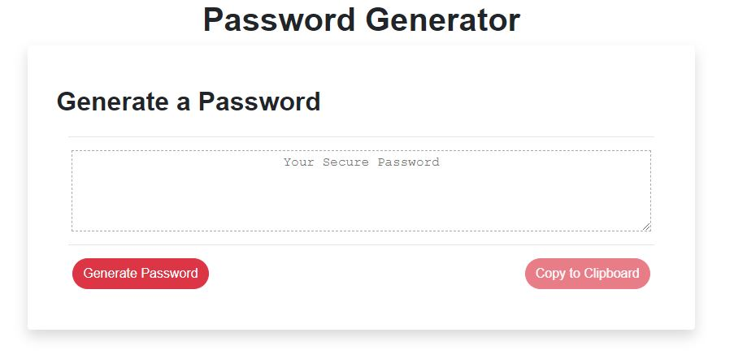
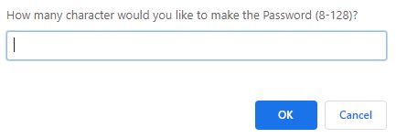
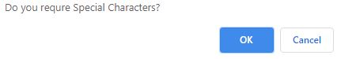
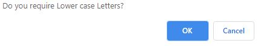
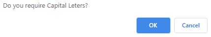
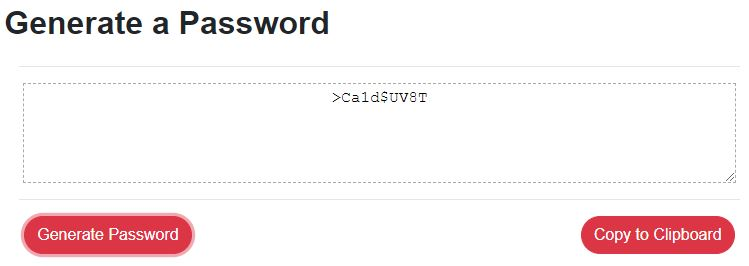

# Password-Generator
Unit 3 Assignment

## Outline
This application generates a random password based on user-selected criteria. 

This app will run in the browser and feature dynamically updated HTML and CSS powered by your JavaScript code.

## Links
#### Github
[https://github.com/bkarulas/Password-Generator](https://github.com/bkarulas/Password-Generator)
#### Application Link
[https://bkarulas.github.io/Password-Generator](https://bkarulas.github.io/Password-Generator)

## Application

The user will be prompted to choose from the following password criteria:

* Length (must be between 8 and 128 characters)
* 

* Character type:

  * Special characters

  * Numeric characters

  * Lowercase characters

  * Uppercase characters

The application should validate user input and ensure that at least one character type is selected.

The user will also have the option to click a button to copy the password to their clipboard.

